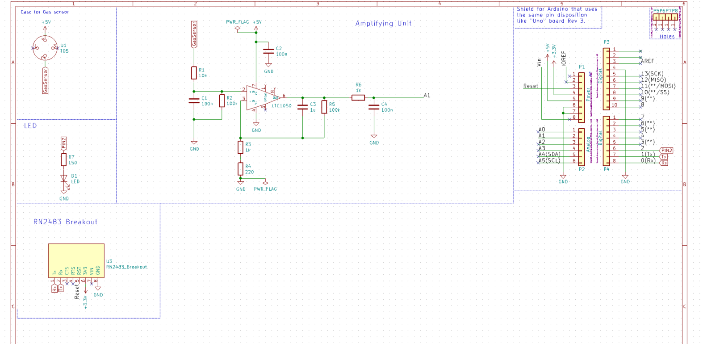
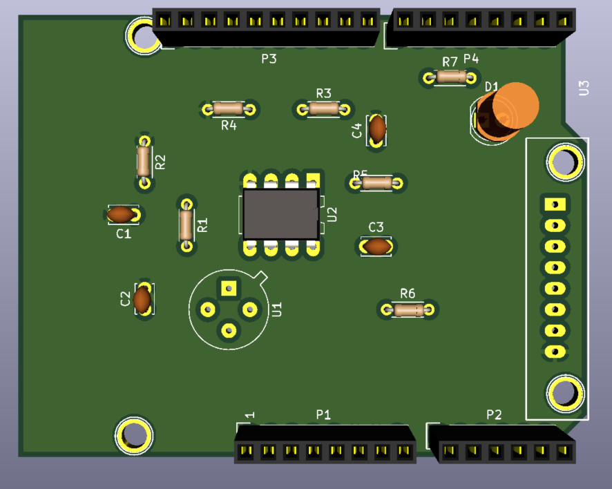
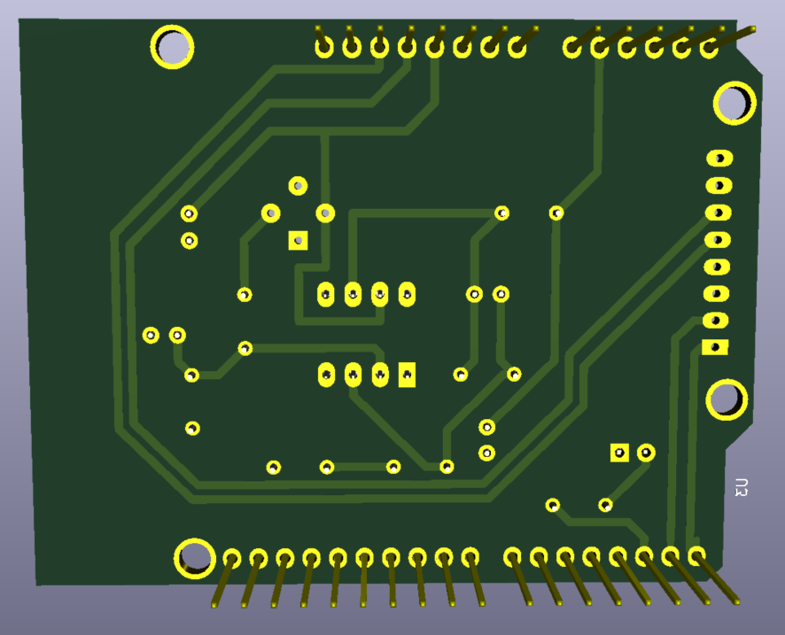

# Arduino Shield for Gaz sensor and LORA
	This project was realized for the Microcontrollers and Open-Source Hardware lecture of the Innovative Smart Systems program at INSA Toulouse. The goal of the lecture was to realize an electronic  board that would be able to communicate the information of a sensor ( gas sensor in our case) to a network (like the Lora network for example). 
	This project could be divided into 2 parts : On one hand, there  is the designing the electronic cards on Kicad. On the other hand, there is the development of the code on Arduino UNO in order to send the information to the Lora network using TTN.
## Getting Started
### Prerequisites
This is what you would need in order to do the project :
•	Arduino Uno
•	Lora chip
•	LED
•	Some resistances  and capacitors
•	Gas sensor ( you can use the MQ2)

### Installing
	You have to install Kicad for the hardware designing ( http://kicad-pcb.org/download/ ) and an IDE for Arduino so that you would be able to develop your code. (https://www.arduino.cc/en/Main/Software )

## Deployment
### Designing the board
	The main goal of the project is to design a shield for the Arduino. This shield should be able to accommodate both the gas sensor and the Lora chip . The gas sensor would be put on a T05 case (http://fr.rsonline.com/web/p/photodiodes/7378098/). For the Lora puce (RN2483), I decided to only place a connectivity module in order to save space.  In addition, the impedance of the sensors could go up to 100 M. This forced us to implement an amplifier circuit. 

