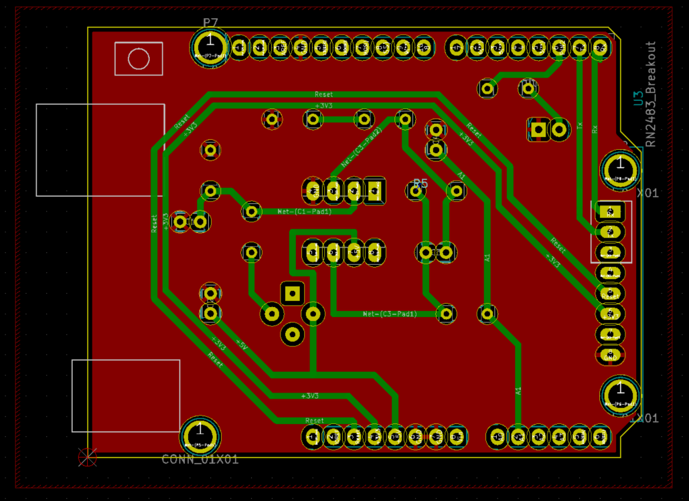

# Arduino Shield for Gaz sensor and LORA
This project was realized for the Microcontrollers and Open-Source Hardware lecture of the Innovative Smart Systems program at INSA Toulouse. The goal of the lecture is to realize an electronic board that would be able to send the information gathered by a sensor (gas sensor in our case) to a network (like the Lora network).   
This project could be divided into 2 parts :   
Designing the electronic card on Kicad in order to implement the gas sensor and the Lora chip. (Hardware)     
Development of the code on Arduino UNO in order to send the information to the Lora network using TTN. (Software)    

## Getting Started
### Prerequisites
This is what you would need in order to do the project :
<ul>
    <li>Arduino Uno</li>
    <li>Lora chip - RN2483_breakout</li>
    <li>LED</li>
    <li>Some resistances and capacitors</li>
    <li>Gas sensor ( you can use the MQ2) with the shield (T0-5)</li>
</ul>

### Installing
You have to install Kicad for the hardware designing ( http://kicad-pcb.org/download/ ) and an IDE for Arduino so that you would be able to develop your code.(https://www.arduino.cc/en/Main/Software )

## Deployment
### Designing the board
#### Schematic
The main goal of the project is to design a shield for the Arduino. This shield should be able to accommodate both the gas sensor and the Lora chip.   
If you look at the figure 1, the design of the shield could be divides into 5 parts :  
On the top left, you have the gaz sensor that would be inserted into a T05 case (http://fr.rsonline.com/web/p/photodiodes/7378098/). The T05 case has normally 4 pins but I decided to keep only 2 for this project because I won't be implementing the heating resistor. The led connected to a digital pin on the arduino would turn on and off depending on the information sent by the gas sensor. For the Lora puce (RN2483), I decided to eliminate the RN2483_breakout module and place a connectivity module instead in order to save space. So you would only need wires to connect the Lora chip to the shield. In the middle on figure 1, you have an amplifier unit. This is due to the fact that the impedance of the sensors could go up to 100 Mega ohms forcing us to implement an amplifier circuit. Finally you have the arduino uno with all the connections on the top right of the image.

                                                 Fig 1 : The Schematic of the shield

#### PCB
Once the schematic is done, you could go on and start with the routing. Here are some tips in order to have a good PCB :
- Try to do all the routing on one side.
- Minimize the length of the connections. A good way to do this is to have a ground plane.
- There is minimum width on the wiring depending on your footprints and your printing machine. In my design I had a track size of 20       mil, with 24 mil isolation.  

   
 
                                                    Fig 2 : 2-D view of the PCB 

                                                 

                                                Fig 3 : 3-D view of the PCB (front)

                                                 Fig 4 : 3-D view of the PCB (back)

### Setting up the arduino and Lora Network

In this part, I will talk about how you can send any data from the arduino to a Network using Lora. For this project I used the thing network because it is easy to set up and to use. (https://www.thethingsnetwork.org/)
You can find the arduino code iside the Arduino folder. This code has 2 objectives :
- Receive data from the Gas sensor and send it to the thing network
- Turn on the Led depending on the value of the gas sensor

Please pay attention to the commentary given in the code because it gives detailed explanation on how to connect your arduino and set up the TTN network. If you have any trouble with the Lora network you can check the think network website in which everything is fully explained. (https://www.thethingsnetwork.org/docs/devices/uno/quick-start.html)

## Improvements
### Hardware

It would been very interseting to measure the energy consumption of the arduino, the Lora chip and the gas sensor. In case of a big energy consumption, we can modify the arduino code in order to put the gas sensor and the Lora chip on sleep mode when they are not working. If this isn't enough we can implement a switch in order to disconnect the gas sensor when we are not sending any information.

### Software

On the software part, a lot of things can be added :
-  For instance, we only send information to the thing network (uplink). It would be great if we could receive an order from the TTN. (downlink). For example, instead of controlling the led from the arduino, we do it from the network. This way we can change the treshold easily for different applications.
- It could also be a good idea if we can have an interface in order to display and control the data sent by the sensor. To do so, I recommend to use the nodered application. (https://moodle.insa-toulouse.fr/pluginfile.php/88340/mod_resource/content/0/Procedure_DRAGINO__TTN_NodeRed.pdf)

## FAQ

If you are not receiving any data from the sensors, go to your device and clic on Reset xxx frames.

## Included
- Shield folder containing all the files for Kicad
- Arduino Folder containg the code
- Readme file

## Authors
Negatu Michael   
5th year student at Insa de Toulouse majoring in automatics and electronics  
Innovative Smart System  

## Acknowledgments
Jean-Louis NOULLET for the design of the amplifier circuit.    
Jérémie GRISOLIA and Benjamin MESTRE for the lecture in which we learned  a lot on Arduino.  
Arnauld BIGANZOLI for the KiCad lectures and initiation on Github.  
Catherine CROUZET for the wielding of the shields.  

